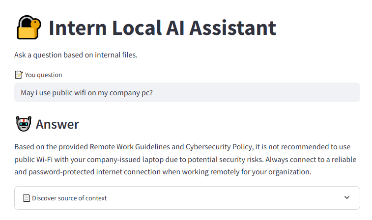

# Secure Document Assistant

A fully private, locally-hosted Retrieval-Augmented Generation (RAG) system that lets you chat with internal company documents using open-source AI models.

  

### Overview

This assistant loads structured and unstructured documents (e.g., PDFs), embeds them into a vector database, and lets you ask questions via a Streamlit-based chat interface. Everything runs locally using Ollama and an open-source LLM like mistral.

No cloud dependencies. No data ever leaves your machine.

## Use Case

Ideal for companies or projects that need:

High data privacy and security

AI access to technical manuals, policy documents, internal guidelines

Offline-capable assistant to support employees and analysts

## Features

Ingests and parses PDF documents (can easily extend to CSV, DOCX, TXT)

Embeds content using sentence-transformers and stores in FAISS

Retrieves relevant document chunks with semantic similarity

Runs a local LLM with Ollama (default: mistral)

Clean Streamlit UI for interactive Q&A

## How to Run It

### 1. Install dependencies

pip install -r requirements.txt

### 2. Start Ollama and load the model

ollama run mistral

(Keep this terminal open)

### 3. Add your documents

Put your .pdf files in the data/ folder.

### 4. Create/refresh the vector index

python rag_pipeline/embed_and_index.py

### 5. Run the chat app

streamlit run app/app.py

## Tech Stack

Python, Streamlit, Ollama (for LLM inference), sentence-transformers (MiniLM) & FAISS (vector search)

